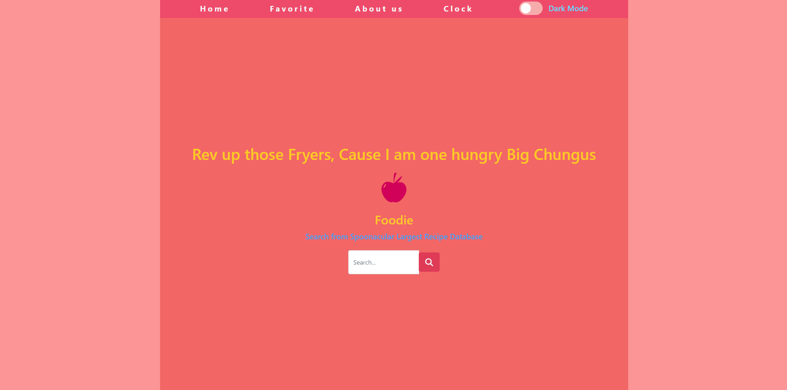
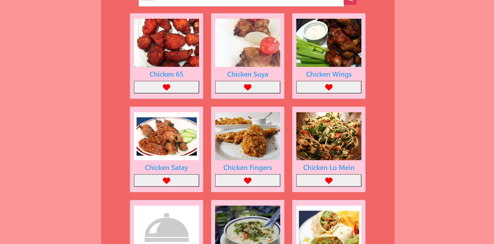

# 🍽  Foodie  🍽 

During my Javascript Development bootcamp this was my final project submission. My course helped me learn the basics knowledge of Javascript by using funcitons, API's, and also jquery. The assignment was to use any api of our choosing and linking it to a google cloud firestore database. I do acknowledge that this project is behind on the current version of react.
## Demo
https://65078b27d7cc59000816ab7d--neighbormydog.netlify.app/

## Screenshots

## Badges

